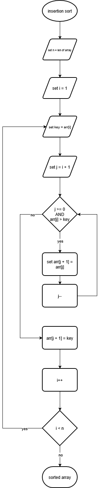

# Insertion Sort
For the assignment, I chose to do the Insertion Sort. I chose this because it is a sorting algorithm that I am not too familar with, so I thought it would be a great learning opportunity as well as a topic to base my assignment around.
## Demo Video
- Shows 2 Cases, the placeholder/default array, and the already sorted array.
- Shows 1 error I've come across, if a preset shows error on the visualization, simply choose another preset, click start sorting, then switch back to the broken preset and it should work.
<video controls src="mddemovideo.mp4" title="Demo Video"></video>

## Problem Breakdown and Computational Thinking
### Decomposition
Starts at the second element, moving through each element afterwards. The current element is selected as the key (to later be inserted into the sorted position). The key is then compared with elements to the right and left, and identifies where the key is meant to go. Then, elements greater than the key are shifted 1 position right, and the key is then inserted in the now-empty position. This is repeated until the array is sorted.
### Pattern Recognition
The whole algorithm (and all sorting algorithms for that matter), repeat every step until the array is sorted. In Insertion Sort's case, each element is accessed every step, using two loops (for loop and while loop) to do so. They key value is then compared with other elements. After this, each element is shifted to the right.
### Abstraction
SHOW to the User:
- Current state of the array
- Current element being inserted (key)
- Sorted vs. Unsorted portions
- Which two elements are being compared
- Element movements (shifting process)
- Comparison count?

HIDE from the User:
- Index operations (j, j + 1, j - 1, etc.) can instead be shown as movement in the GUI
- Range checking
### Algorithm Design
Input:
- Array of Integers
### Flowchart

Processing:
1. Print starting (unsorted) array
2. Each Algorithm step:
    - Show current operations
    - Show comparisons
    - Show element movement
    - Update stats (comparions, swaps, etc.)
3. User Controls:
    - Iterate steps (next/previous)
    - Array input (manual or preset)

Output:
1. Sorted array
2. Statistics:
    - Total comparisons
    - Total swaps/shifts
    - Time complexity?
    - Total passes/iterations?
## Steps to Run
1. Enter array OR choose preset array
2. Click 'start sorting'
3. Click either '<- previous' or 'next ->' to iterate through steps
## HUGGING FACE LINK
https://huggingface.co/spaces/sorgardion/CISC121_PROJECT_SORGARD_GRIFFIN
## Author and Acknowledgement
Griffin Sorgard
CISC 121
December 2nd, 2025
Dr. Ruslan Kain